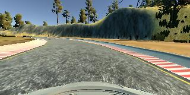
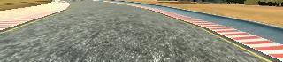
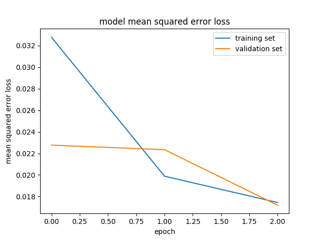

# **Behavioral Cloning** 


Write-up: BRIAN 'HAN UL' LEE


---

**Behavioral Cloning Project**

The goals / steps of this project are the following:
* Use the simulator to collect data of good driving behavior
* Build, a convolution neural network in Keras that predicts steering angles from images
* Train and validate the model with a training and validation set
* Test that the model successfully drives around track one without leaving the road

## Rubric Points
### Here I will consider the [rubric points](https://review.udacity.com/#!/rubrics/432/view) individually and describe how I addressed each point in my implementation.  

---
### Files Submitted & Code Quality

#### 1. Submission includes all required files and can be used to run the simulator in autonomous mode

My project includes the following files:
* model.py containing the final script to create and train the model
* clone.py containing the script that I used to test/develop the model
* drive.py for driving the car in autonomous mode
* model.h5 containing a trained convolution neural network 
* video.py containing the script that compiles images created by drive.py into an mp4 video file
* video.mp4 containing the video of one-lap around Track 1 by my model (model.py)
* writeup_report.md or writeup_report.pdf summarizing the results

#### 2. Submission includes functional code
Using the Udacity provided simulator and my drive.py file, the car can be driven autonomously around the track by executing 
```sh
python drive.py model.h5
```

#### 3. Submission code is usable and readable

The model.py file contains the code for training and saving the convolution neural network. 
The file shows the pipeline I used for training and validating the model, and it contains comments to explain how the code works.


### Model Architecture and Training Strategy

#### 1. Solution Design Approach

The overall strategy for deriving a model architecture was to first try the bare-bone flatten layer as the tutorials introduced with the udacity provided datasets and then try more sophisticated models. The first shot was actually not too bad. The car did stay within the road except that it was right at the limit of the road (on the right side). However, as it went to the sections where the red dashed sidelines are, the car increasingly drove to the right side limit of the road and eventually when sharper corners, came, it went off the road. Also, with this bare-bone model, adding the left and right camera data seemed to worsen the results, and the car was going off the road right from the get-go into the mountains and into the lake, etc. I believe this was due to the fact that the images were not cropped and thus adding the left and right camera images pounded on more environment noises (trees, lakes, etc.) than before.

I then implemented the NVIDIA deep neural networks published on the internet. Also, I recorded my own training data, which I purposely made it very short and I purposely drove it off the road to see if my network will drive the car off the road, and it did.
The model was trained and validated on different data sets to check that the model was not overfitting (model.py line 14). For my model, with enough data provided, extra overfitting mitigation techniques such as dropout layer, pooling layer, or regularization did not have to be included. 
The model was tested by running it through the simulator and ensuring that the vehicle could stay on the track.

For pre-processing, I tried to add flipped images as well but it exceeded my memory and my pyCharm failed with memory error. I considered using the amazon services but I wanted to see if my computer can handle this task.
So I went onto implement the generator for my model, put batching scheme in place, and using fit_generator I was able to only use a max of 1GB on my computer and the model could be trained properly. I used verbose=1 option in fit_generator to be able to see the progress and how much time is left for training.
As for flipped images, I ended up not needing them as my result was satisfactory without them. However, what really proved effective was cropping images so that as much background noise as possible was removed.
I played around with different cropping regions and the ideal solution for me was to crop 65 pixels from the top which contains a lot of the sceneries and 25 pixels from the bottom which contains the hood part of the car. With this cropping applied, as shown in the images below for comparison, only the road could be focused on for my deep neural network to learn my driving behaviour on.

Example original image:


Example cropped image:


I then went on to record a more proper data, but my computer's spec is not that great (surface pro 1) and the simulator lagged so badly that I could not drive a full lap without going off the road. I tried my best however and saved around a half-lap of data.
However, visualizing graph of train and validation results against epochs showed that while training error consistently decreased while validation error was bouncing up and down. So I just went and recorded more data.
And this time, I set the simulator to the "fastest" mode and I was able to drive the car precisely the way I wanted to. I recorded around 3 laps of data to provide enough data to avoid overfitting, and it worked fine without the need of a drop-out layer.

The final step was to run the simulator to see how well the car was driving around track one. 
The car actually drove very smoothly and I was impressed by my model. The car almost always stayed dead center and even when I take over and drive the car nearly off the road or slightly off the road, the car managed to find itself right back to the center in smooth fashion.


#### 2. Final Model Architecture

My final model (model.py line 49~81)closely resembles the NVIDIA self-driving car neural network published here (nvidia architecture)https://devblogs.nvidia.com/parallelforall/deep-learning-self-driving-cars/
The model includes RELU to introduce nonlinearity and the data is normalized in the model using a Keras lambda layer (model.py line 70).
Cropping was very effective in improving the performance of my model and showed the importance of reducing background noise in deep neural network's ability to learn.
The architecture's summary containing description of eah layer and the shape and size can be found below: a total number of 12 layers were employed and the total number of parameters were 559,419.
Keras sequential model building was used in order to assure the layers are run in the correct order.


```text
Layer (type)                     Output Shape          Param #     Connected to                     
====================================================================================================
lambda_1 (Lambda)                (None, 160, 320, 3)   0           lambda_input_1[0][0]             
____________________________________________________________________________________________________
cropping2d_1 (Cropping2D)        (None, 70, 320, 3)    0           lambda_1[0][0]                   
____________________________________________________________________________________________________
convolution2d_1 (Convolution2D)  (None, 33, 158, 24)   1824        cropping2d_1[0][0]               
____________________________________________________________________________________________________
convolution2d_2 (Convolution2D)  (None, 15, 77, 36)    21636       convolution2d_1[0][0]            
____________________________________________________________________________________________________
convolution2d_3 (Convolution2D)  (None, 6, 37, 48)     43248       convolution2d_2[0][0]            
____________________________________________________________________________________________________
convolution2d_4 (Convolution2D)  (None, 4, 35, 64)     27712       convolution2d_3[0][0]            
____________________________________________________________________________________________________
convolution2d_5 (Convolution2D)  (None, 2, 33, 64)     36928       convolution2d_4[0][0]            
____________________________________________________________________________________________________
flatten_1 (Flatten)              (None, 4224)          0           convolution2d_5[0][0]            
____________________________________________________________________________________________________
dense_1 (Dense)                  (None, 100)           422500      flatten_1[0][0]                  
____________________________________________________________________________________________________
dense_2 (Dense)                  (None, 50)            5050        dense_1[0][0]                    
____________________________________________________________________________________________________
dense_3 (Dense)                  (None, 10)            510         dense_2[0][0]                    
____________________________________________________________________________________________________
dense_4 (Dense)                  (None, 1)             11          dense_3[0][0]                    
====================================================================================================
Total params: 559,419
Trainable params: 559,419
Non-trainable params: 0

epoch 0: 2592/2581 [==============================] - 210s - loss: 0.0328 - val_loss: 0.0228
epoch 1: 2592/2581 [==============================] - 181s - loss: 0.0199 - val_loss: 0.0223
epoch 2:2655/2581 [==============================] - 184s - loss: 0.0174 - val_loss: 0.0172

```

The resulting validation & training errors vs epochs is as follows and it shows the the model was trained just right as can be seen in validation and training errors converging and declining with every epoch:
 

There were additional implementations I was considering to make such as follows, but I found out that my model handled Track 1 so nicely that any further additions seemed like they won't improve it much. There's the good old engineering saying, if it ain't broken, don't fix it.
1. Adding drop-out layer: perhaps this could even make the autonomous drive even more smooth
2. Try more epochs: this could also help my model learn more precisely to follow my driving behaviour, but it should not be too high because the model can overfit
3. Flip augmentation: this track mostly runs in the counter-clockwise direction, but maybe on a different track that is mostly clock-wise, the flip augmented data will help my model generalize better and drive well on both clockwise and counter-clockwise tracks
4. Adding distorted images using keras data generator to ensure there are equally many soft-curve and hard-curve roads as there are straight-roads.

#### 3. Creation of the Training Set & Training Process

Training data was chosen to keep the vehicle driving on the road without going astray from the road. 
I just used the basic feature of human (me), namely inconsistency. There was no way I was going to achieve the exact same cornering and center driving on around 3 laps consecutively. Yes, it is technically possible to achieve near-identical driving behaviour, but I just let my self go and drove casually as an average human would.
Hence, if you can see my training data, for the most part it does drive in the center of the road in straight roads and curved roads alike, sometimes I veer off to the limits of the roads and make mistakes and recover. These subtle mistakes helped my training datasets to capture various "views" of the same roads and therefore the "right" steering angle actions to be taken to bring it to the center.

I randomly shuffled the data set for each batch using sklearn.utils.shuffle (model.py line 58). 

I used this training data for training the model. The validation set helped determine if the model was over or under fitting. 
For epochs, I stuck with 3 since my computer doesn't have a GPU and I could not wait too long between each training. But 3 seemed to work splendidly. 
I used an adam optimizer so that manually training the learning rate wasn't necessary (model.py line 84).
